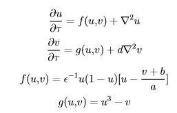
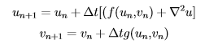
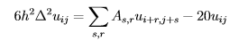
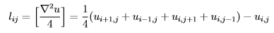

#Spiral Waves
---------------------

# Project Description
This is an implementational study of the reaction-diffusin model as described by Barkley **et al**. 



The domain is represented as a 2D square of size L with zero-flux boundary conditions.


The parameters used for this model are epsilon = 1/14, a = 0.75, b = 0.06, L = 80, and d = 0.


Spiral-wave dynamics in a simple model of excitable media: The transition from simple to compound rotation. 
D. Barkley, M. Kness, and L. S. Tuckerman, Phys. Rev. A 42, 2489 (1990)
http://www.pmmh.espci.fr/~laurette/papers/meandering.pdf


### SpiralWavesAnalysis.m
:exclamation: ``` SpiralWavesAnalysis.m``` requires the Symbolic Math Toolbox

This script finds and evaluates the homogeneous steady states.

The figure shows chemical u, v concentrations together with the corresponding nullclines (f(u,v) = 0 and g(u,v) = 0).

The homogenous steady states are found from the intersection points and we find the stable points by evaluating the Jacobian for the above equation at these intersections.


### SpiralWaves.m
I simulate this reaction with a simple Euleur forward scheme:



To evaluate the above laplacian numerically I use a finite differnces method on a regular square grid. The original paper used the nine-point formula



The same methodology is implemented here but with a five-point formula, giving the following approximation of the Laplace's differential operator applied to u in the interior domain



Below is a figure of the initial concentration domain of u and v


After some time we start observing the spiral waves


If we observed a fixed point in the xy-plane (20,20) we can see that the system goes to (0,0) and for small perturbations goes one cycle clockwise, in accordance to the figure above. 


If we change the epsilon parameter (say from 1/14 to 1/12) we change the timescale between the u and v reaction. This results in that the spiral waves move to fast and we get a breakup as seen below.


:bowtie:

